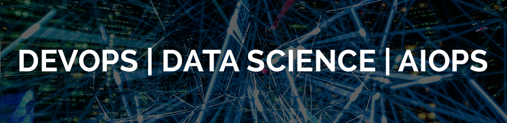

  

# Ezequiel Barros
*Devops Enginner* na equipe de Conteúdo do UOL

Como Devops Enginner e entusiasta em Data Science, eu combino habilidades analíticas, capacidade para trabalhar em ambientes de equipe com atenção aos detalhes. Nos últimos anos tenho trabalhado na administração de diversas aplicações de missão crítica dentro do portal [UOL](https://www.uol.com.br), onde desenvolvi um pensamento crítico e habilidades para resolução de problemas.

Atuamente estou estudando Data Science para entender como implementar e ter sucesso num projeto de AIOPS.

Sou formado em Ciência da Computação pela Universidade Paulista (UNIP).

**Habilidades em:** Python, Linux, Cloud Computing (AWS), Ansible, Puppet, Apache HTTP, Nginx.

**Links:**

* [LinkedIn](https://www.linkedin.com/in/ezequielbarros/)
* [Medium](https://medium.com/ezequielsbarros)

## Projetos:
Veja meus projetos publicados no github e blog pessoal.

Data Science:
* **Análise dos Dados do Airbnb em Lisboa, Portugal:** http://bit.ly/AnaliseAirbnbLisboa

Devops:
* **MyTwitterApi - Case de implementação dos três pilares da observabilidade:** https://bit.ly/mytwitterapi

---
